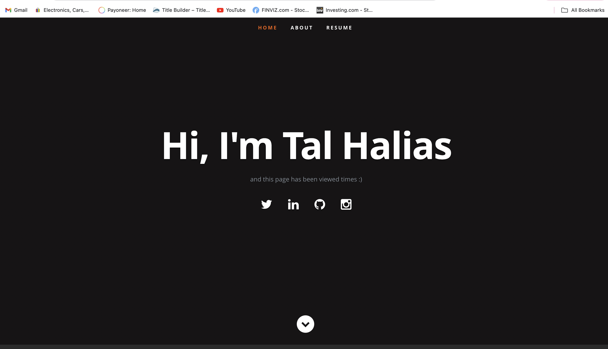

# TerraformAZ

TerraformAZ is a Terraform project designed to set up and manage an Azure infrastructure that includes an Azure Function App serving static files from Azure Blob Storage. This project demonstrates how to use Terraform to deploy a comprehensive Azure environment and integrate various Azure services.

## Project Overview

The TerraformAZ project automates the deployment of the following Azure resources:

- **Resource Group**: A container for all Azure resources.
- **Storage Account**: Used for hosting static website files and diagnostics logs.
- **Function App**: Hosts a serverless function that serves static files from Azure Blob Storage.
- **App Service Plan**: Manages the pricing tier for the Function App.
- **Virtual Network (VNet)**: Provides network isolation.
- **Subnet**: Defines network boundaries within the VNet.
- **Network Security Group (NSG)**: Controls inbound and outbound traffic to resources.
- **Route Table**: Manages routing for network traffic.
- **Diagnostic Settings**: Configures diagnostics logging for the Function App and Storage Account.
- **Log Analytics Workspace**: Aggregates and analyzes log data.

## Prerequisites

- [Terraform](https://www.terraform.io/downloads.html) installed.
- An Azure subscription.
- [Azure CLI](https://docs.microsoft.com/en-us/cli/azure/install-azure-cli) installed and configured.
- Basic understanding of Terraform and Azure services.

## Getting Started

1. **Clone the Repository:**

   ```bash
   git clone https://github.com/yourusername/TerraformAZ.git
   cd TerraformAZ
   ```


2. **Configure Azure CLI:**

```
az login
```

3. **Initialize Terraform:**

```
terraform init
```

4. **Plan the Deployment:**

Create an execution plan to review changes:
```
terraform plan
```
5. **Apply the Configuration:**

```
terraform apply -auto-approve
```

6. **Verify Deployment:**

Check the Azure Portal to ensure all resources have been deployed correctly. The Function App URL will be available under the Function App’s overview.

## Function App Configuration

The Function App is configured to serve static files from an Azure Blob Storage container. Ensure the connection string for the Blob Storage account is set in the Function App settings. The function code in func.py handles HTTP requests and serves static files based on the request parameters.

### Steps to deploy your function:

1### Steps to Deploy Your Function:

1. **Prepare Your Function Code:**
   - Ensure your function code (`func.js` or relevant file) is correctly implemented and tested locally.

2. **Package Your Function App:**
   - If deploying from a ZIP file, create the ZIP package containing your function code and dependencies. For example:
     ```bash
     zip -r func.zip func.js host.json function.json 
     ```


3. **Deploy the Function Code:**
   - If you are using a deployment package, upload the ZIP file to your Function App using the Azure CLI:
     ```bash
     az functionapp deployment source config-zip \
     --resource-group az-rg \
     --name TalsFunctionApp-fa \
      --src func.zip
     ```

4. **Verify Deployment:**
   - Go to the Azure Portal and check the Function App’s overview to ensure it is running and that the function code has been deployed correctly.
   - Test your function by sending HTTP requests to the Function App URL and ensure it serves static files as expected.

5. **Monitor and Troubleshoot:**
   - Utilize Azure Monitor and Log Analytics to monitor the performance of your Function App and diagnose any issues.
   - Review logs and metrics to troubleshoot any deployment or runtime issues.

### Proof of Work




